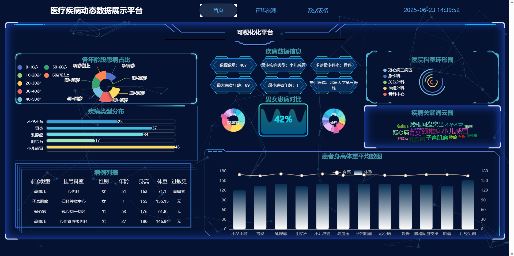
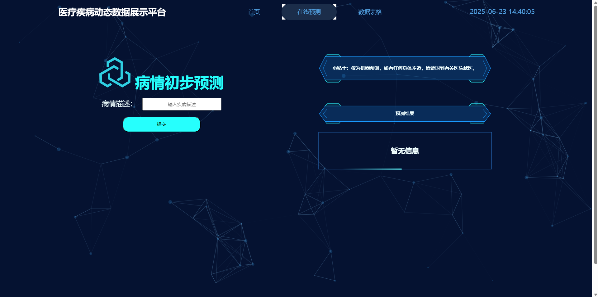

# 医学数据可视化平台

### 一、项目介绍
+ 该项目主要对网站的数据做了数据分析，数据可视化和模型预测。
+ 主要技术栈包含了flask、vue、爬虫、机器学习、数据库语言。
+ 前端vue模板使用的是 [gittree模板连接](https://gitee.com/S-maug/front-end-template-1)，模板为vue2框架，本项目的script也是沿用的vue2的框架续写的。
+ 后端使用了flask框架，数据库使用的postgresql，数据库管理系统使用DBeaver。

---
### 二、展示效果
+ **主界面展示**

+ **预测界面展示**

+ 感兴趣的话，可以观看一下b站交互页面展示效果。
https://www.bilibili.com/video/BV17GKtz6Eg6